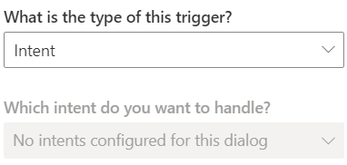
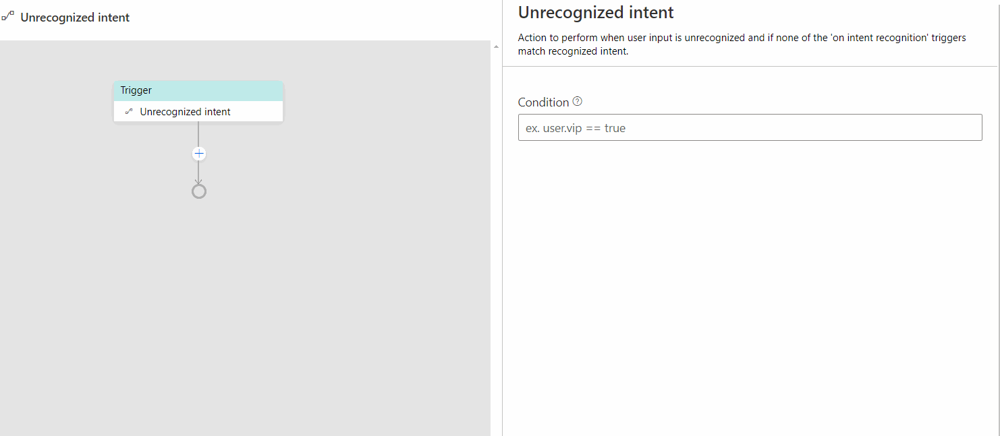
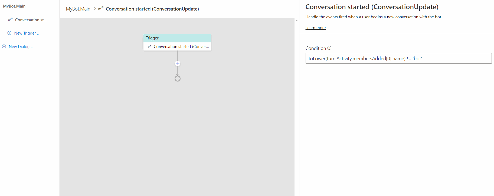
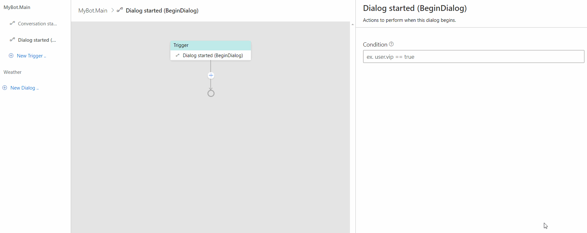
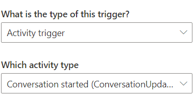
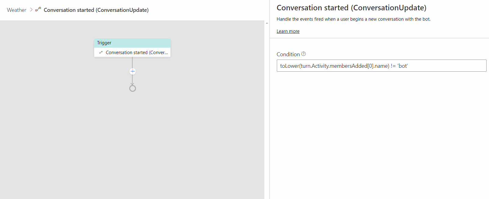
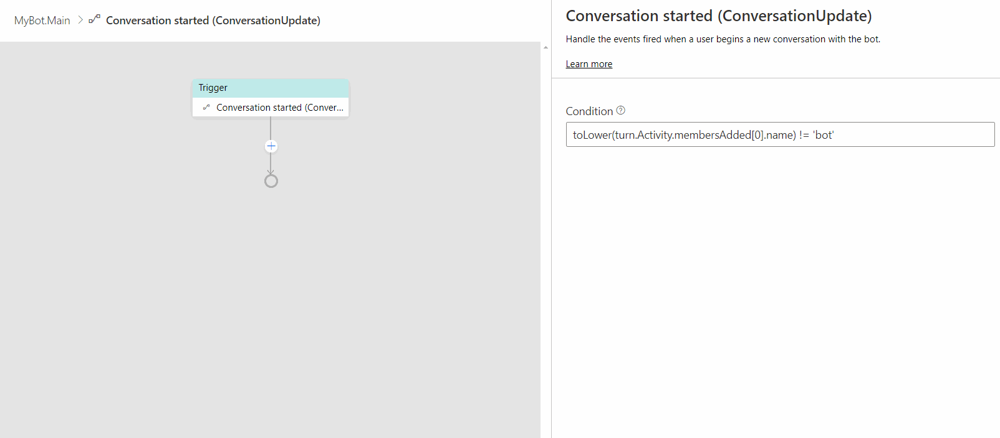
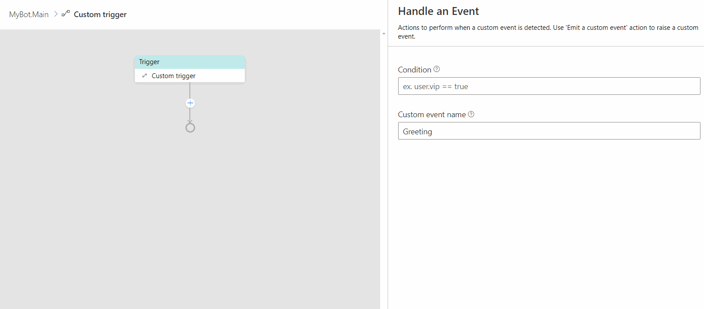

# Defining triggers 
Each dialog in Bot Framework Composer includes a set of triggers (event handlers) that contain instructions for how the bot will respond to inputs received when the dialog is active. There are several different types of triggers in Composer. They all work in a similar manner and can be interchanged in some cases. In this article, we will walk you through how to define each type of trigger. If you are not familiar with events and triggers in Composer, please read the [events and triggers](concept-events-and-triggers.md) concept article. 

The table below lists the six different types of triggers in Composer and their descriptions. 

| Trigger Type             | Description                                                                             |
| ------------------------ | --------------------------------------------------------------------------------------- |
| Intent                   | Trigger an action when an **intent** is recognized (and optionally **entities**)        |
| Unrecognized intent      | Trigger an action when no intent is recognized                                          |
| Dialog trigger           | Trigger an action when a dialog event such as **BeginDialog** is fired                  |
| Activity trigger         | Trigger an action to take when an activity event such as when a new conversation starts |
| Message activity trigger | Trigger an action to take when a message activity is fired.                             |
| Custom trigger           | Trigger a pre-defined custom event such as **Emit a custom event**.                     |
## Intent
In **Intent** trigger you define actions to take when an intent is recognized (and optionally entities). It is a trigger that works with **recognizers**. There are two **recognizers** in Composer: [LUIS](https://www.luis.ai) recognizer and [Regular Expression](https://regexr.com/) recognizer. On the navigation pane, click **New Trigger** and then select **Intent** from the drop-down menu. You will see the intent trigger menu as follows: 

If you have not defined any intents, the **Intent** trigger sub-menu will show "No intents configured for this dialog" and there is no intent to configure. The basic steps to define an **Intent** trigger are as follows:
- select a recognizer type in your selected dialog
- define intent(s) in language understanding editor
- create **Intent** triggers to handle pre-defined intents (one trigger handles one intent)
- define actions in the trigger 

You can find detailed instructions on how to define an **Intent** trigger with LUIS [here](concept-events-and-triggers.md#LUIS-recognizer) and how to define an **Intent** trigger with Regular Expression [here](concept-events-and-triggers.md#Regular-expression-recognizer). 

## Unrecognized intent 
**Unrecognized intent** defines actions to take when an intent is not recognized. For this trigger, you do not need to define any intents. Follow the steps to define an **Unrecognized intent** trigger:
<!-- Please note that an "Unknown Intent" will defer to any specific intent that fires in a parent dialog.  -->
### 1. Create an **Unrecognized intent** trigger 
On the navigation pane, click **New Trigger** and then select **Unrecognized intent** from the drop-down menu. You will see the trigger menu as follows: 

After you click **Submit**, you will see an empty **Unrecognized intent** trigger in the authoring canvas. 

### 2. Add an action(s) to the trigger
Under the trigger, click the "+" sign to add the action node(s) you want to include. For example, you can click **Send a response** to send a message "This is an unrecognized intent trigger!" authored in [.lg file format](https://github.com/microsoft/BotBuilder-Samples/blob/master/experimental/language-generation/docs/lg-file-format.md). When this trigger is fired, the response message will be sent to the user. 

  

## Dialog trigger 
This is a trigger type we use to define actions to take when a dialog event such as `BeginDialog` is fired. Most dialogs will include an event handler (trigger) configured to respond to the `BeginDialog` event, which fires when the dialog begins and allows the bot to respond immediately. Follow the steps below to define a **BeginDialog** trigger: 

### 1. Create a **BeginDialog** trigger
On dialog navigation pane, click **New Trigger** and select **Dialog started(BeginDialog)** from the drop-down menu. Click **Submit**. 

### 2. Add dialog action(s) to the trigger
Under this trigger, click the "+" sign and mouse over the action menu. Click **Dialog management** and then select **Begin a new dialog**. Configure a pre-defined dialog to the **Begin a new dialog** action in the properties panel. This mean before you use this trigger you must define a dialog to be configured to this trigger.

 

## Activity trigger 
This is a type of trigger used to handle activity events such as your bot receiving a `ConversationUpdate` Activity. This indicates a new conversation begins and you use a **Conversation started (ConversationUpdate)** trigger to handle it. Follow the steps below to define a **Conversation started (ConversationUpdate)** trigger and send a welcome message: 

### 1. Create a **ConversationUpdate** trigger
On the navigation pane on the left side, click **New Trigger** in your selected dialog and choose **Activity trigger** and then **Conversation started (ConversationUpdate)** from the drop-down menu. Click **submit**. 

### 2. Add an action node to the trigger
Under this trigger, click the "+" sign and mouse over the action menu then click **Send a response**. In the language generation editor, author your response message following [.lg file format](https://github.com/microsoft/BotBuilder-Samples/blob/master/experimental/language-generation/docs/lg-file-format.md). 

## Custom trigger
**Custom trigger** is a trigger to handle a custom event such as **Emit a custom event**. Bots can emit user-defined events using the **Emit a custom event** which will trigger this handler. Follow the steps below to define a **Custom trigger**: 

### 1. Define **Emit a custom event**
In your bot's authoring canvas, select the trigger you want to define **Emit a custom event**. Under this trigger, click the "+" sign and mouse over the action menu. Click **Access external resources** and then select **Emit a custom event**. 

On the properties panel on the right, you can define some properties of this event. Let's give this event a name "Greeting", leave `Event value` as is, and check `Bubble event`. When `Bubble event`is checked this event will be passed on to the parent dialogs to look for handlers to handle it. 

### 2. Create **Custom trigger** to handle the pre-defined event
On the navigation pane on the left, click on **New Trigger** and select **Custom trigger** from the drop-down menu. Click **Submit**. 

On the properties panel on the right, fill in the name of you pre-defined event in the `Custom event name` section. We fill in "Greeting" as we created in step 1. The name in the `Custom event name` section should match the name of the **Emit a custom event** you just created. 

You can add any action to this trigger. Under the trigger, click the "+" sign and select **Send a response** from the actions menu. Author your response for this action in the language generation editor as you want. 

Now you have completed defining a **Custom trigger**. When **Emit a custom event** is fired, the **Custom trigger** will handle this event and send the response you have defined. 

## References
- [Events and triggers](./concept-events-and-triggers.md)

## Next 
Learn how to [control conversation flow](./howto-controlling-conversation-flow.md).
